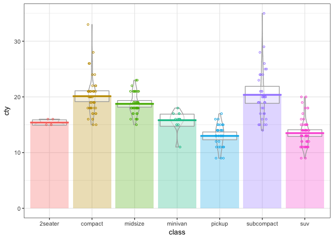
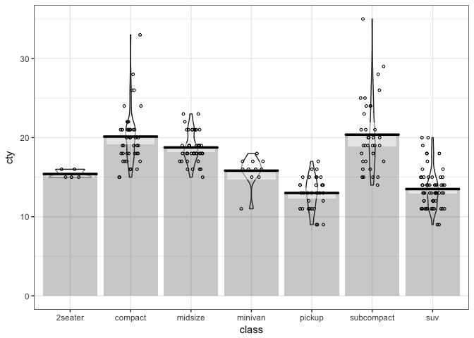

<!-- README.md is generated from README.Rmd. Please edit that file -->
ggpirate
========

A [pirate plot](https://cran.r-project.org/web/packages/yarrr/vignettes/pirateplot.html) is a way of displaying data where a continuous dependent variable is a function of a categorical independent variable, in a more informative way than the traditional barplot. `geom_pirate()` plots the raw data as points (using `ggplot2::geom_jitter()`), along with layers showing descriptive and inferential statistics -- bars indicating means (using `ggplot2::geom_col()`), horizontal line indicating means (using `ggplot2::geom_crossbar()`), boxes indicating 95% confidence intervals assuming a normal sampling distribution (using `ggplot2::geom_rect()`), and violins indicating the density (using `ggplot2::geom_violin()`).

Installation
------------

You can install ggpirate from github with:

``` r
# install.packages("devtools")
devtools::install_github("mikabr/ggpirate")
```

Examples
========

``` r
library(ggpirate)
theme_set(theme_bw())
```

Colour pirate plot:

``` r
ggplot(mpg, aes(x = class, y = displ)) +
  geom_pirate(aes(colour = class, fill = class))
```



Black and white pirate plot:

``` r
ggplot(mpg, aes(x = class, y = displ)) +
  geom_pirate()
```


